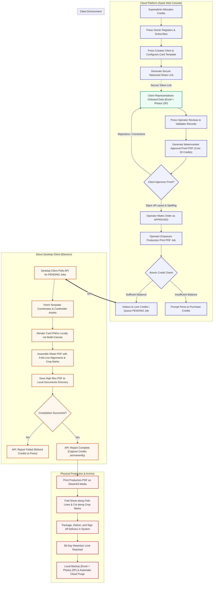
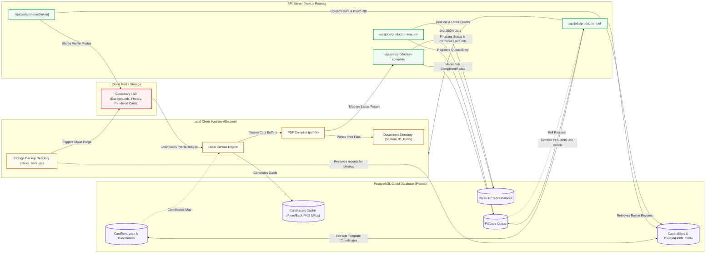

# IDexo ID Card Production Platform — System Data Flow & End-to-End Workflow

This document provides a comprehensive overview of the **IDexo Hybrid ID Card Generation Platform**. It illustrates how data flows between the cloud server, client portal, database, and the native desktop client, as well as the print-production and data archiving workflows. 

Press owners can share this documentation with their technical teams, operations managers, and customers (e.g., schools, universities, and corporate clients) to explain the platform's security, efficiency, speed, and overall data integrity.

---

## 1. High-Level Architecture Overview

IDexo is built on a **hybrid cloud-local architecture**:
*   **Cloud Platform (SaaS Console):** Handles client onboarding, template design mapping, database records, order statuses, billing, and the collaborative data intake portal.
*   **Client Intake Portal:** A secure, tokenized web interface for client organizations to upload rosters (Excel/CSV) and student/employee photos (ZIP folder or individual cameras).
*   **Electron Desktop Client:** A native application running on the printing press's local workstation. To offload heavy server-side CPU utilization, high-resolution PDF rendering, grid generation, and print-mark layout are compiled locally, saving file buffers directly to the OS filesystem.

---

## 2. End-to-End System Workflow

The following flowchart illustrates the entire business lifecycle, from press owner registration to card printing, delivery, and eventual data archiving:

---

## 3. Detailed Data Flow Architecture

The mapping below outlines how data moves between database entities, file storage systems, API routes, and local machines during operations:

---

## 4. Phase-by-Phase Process Breakdown

### Phase 1: Roster & Photo Intake (Client Portal)
*   **Security:** Access is fully tokenized (`ClientPortalShare` table). The client doesn't need platform account credentials; instead, they access via an encrypted URL token.
*   **Roster Upload:** Clients upload an Excel/CSV spreadsheet. The system dynamically maps column headers to the template's required variables (e.g., student name, grade, date of birth, blood group).
*   **Photos Intake:** Photos can be uploaded in bulk via a structured ZIP archive (matching filenames to student roll numbers/IDs) or captured/cropped individually using webcam integration.
*   **Data Integrity Check:** Before an order can move forward, the system runs strict validation checks to flag missing photos, missing critical text fields, or duplicate identifiers.

### Phase 2: Design Mapping & Asset Caching (Press Designer)
*   **Template Coordinates:** In the designer panel, the Press defines exactly where text fields, photos, barcode formats, and QR codes go relative to the card's background image. This layout is stored in `CardTemplate.frontFields` and `backFields` as a JSON coordinate mapping.
*   **Caching (`CardAsset`):** To avoid redundant image generation, cards are compiled once per cardholder and cached. If cardholder details or coordinates change, the cache invalidation algorithm calculates a new MD5 template hash and marks `CardAsset.isStale = true`, forcing a re-render during the next preview or export.

### Phase 3: Approval Cycle & Client Sign-off
*   **Watermarked Proof Sheets:** The press generates an **Approval PDF**. The cloud system compiles the cardholders' cached assets side-by-side (4 or 8 cards per page) with a prominent diagonal watermark (`PROOF SHEET — FOR CLIENT APPROVAL ONLY`).
*   **Cost Structure:** Generation of an approval PDF costs a flat fee of **20 credits** per export.
*   **Client Sign-off:** The PDF contains a signature sheet on the last page. The client representative signs this sheet physically or approves the digital layout. The Press Operator then clicks **Mark as Approved** in the system, transitioning the order status from `APPROVAL_PDF_SENT` to `APPROVED`. This status transition unlocks final production PDF generation.

### Phase 4: Atomic Credit Lock & Job Queue
*   **Deduction Scheme:** Generation of the print-ready file requires credits per cardholder:
    *   **Single-Sided Cards:** 10 credits per cardholder.
    *   **Double-Sided Cards:** 15 credits per cardholder.
*   **Pessimistic Locking:** To prevent double-spending or race conditions over network delays, queuing a production job triggers an atomic transaction:
    1.  The database locks the Press's balance row using `SELECT ... FOR UPDATE`.
    2.  If the balance is sufficient, the system deducts the required credits.
    3.  A `PdfJob` is logged with status `PENDING` and `isLocalJob: true`.
    4.  If the compilation subsequently fails on the client, the transaction automatically refunds the locked credits back to the Press's balance.

### Phase 5: Local Desktop Compilation (Electron)
*   **Polling:** The Electron desktop client polls `/api/jobs/production-poll` once per minute.
*   **Local Rendering:** When a job is fetched, the local Node-Canvas engine downloads the card background templates and cardholder photos, rendering them on a raw canvas at 300 DPI.
*   **Fold-Line Grid Layout:** The compiler groups front and back designs onto A3/sheet grids according to a row-mirroring fold algorithm:
    *   *Front side:* Rendered normal (e.g., Column 1, 2, 3, 4, 5).
    *   *Back side:* Mirrored horizontally (Column 5, 4, 3, 2, 1) and placed below the fold line.
    *   This ensures that when the physical sheet is printed and folded back-to-back, the front and back of each student's card align perfectly before trimming.
*   **Print Marks:** The layout compiler injects:
    *   *Crop marks:* Outer trim lines (5mm hairpins) defining where the cutter cuts the plastic.
    *   *Bleed margins:* Extra background design (3mm) extending past crop marks to prevent white borders due to paper shifting.
    *   *Safe zones:* Margin guidelines inside the card boundary.
    *   *Registration marks:* Targets for high-precision printer calibration.
*   **OS Level Save:** The compiled binary buffer is saved directly to the local PC's documents folder under `/Documents/Student_ID_Prints/Production/`.
*   **Status Update:** The desktop app reports back to `/api/jobs/production-complete`. The server updates the database status to `PRINTING` and records individual `CardPrintRecord` logs.

### Phase 6: Delivery & 90-Day Retention Purge
*   **Delivery Sign-off:** After physical printing, laminating, and cutting, cards are dispatched. The Press Operator inputs the carrier details, count, and scans or uploads a client signature to mark the order as `DELIVERED`.
*   **Automated Archiving Daemon:** In compliance with strict student data privacy regulations (e.g., GDPR/COPPA), cardholder records cannot sit indefinitely on cloud databases. Every week, the Desktop Client runs a retention script:
    1.  Queries the server for records older than 90 days.
    2.  Extracts the metadata into a local backup Excel sheet (`backup_data.xlsx`).
    3.  Downloads profile pictures, saving them locally in `/IDexo_Backups/{clientName}/{templateName}/{date}/photos.zip`.
    4.  Calls the cloud deletion API to permanently purge the student records, custom fields, and profile photos from PostgreSQL and Cloudinary, leaving the press with a secure local archive.

---

## 5. System Limits & Plan Boundaries

For planning resource allocations, the platform enforces the following system boundaries:

| Plan Level | Max Card Count (Per Order) | Monthly Volume Limits | Production Grids (A3, Bleeds, Marks) | Pricing |
| :--- | :--- | :--- | :--- | :--- |
| **Free Trial** | Up to 100 total cards | N/A | Available (Subject to 100 total limit) | 14 Days Free |
| **BASIC Plan** | 500 cards | 10,000 cards / month | **Not Available** (Individual PDFs only) | Monthly Sub. |
| **PRO Plan** | 2,500 cards | 50,000 cards / month | **Available** | Monthly Sub. + Credits |
| **ENTERPRISE** | Custom | Custom | **Available** (Custom paper grids supported) | Custom Quote |
