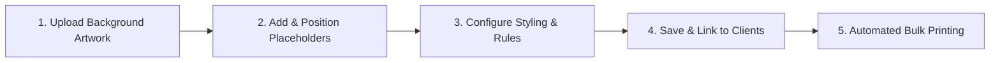

# 🎴 IDexo ID Card Template Creation — Complete User Manual

> **Welcome to the IDexo Template Designer User Manual!**  
> This guide is specially designed for non-technical users, print shop staff, school administrators, and designers. It provides a simple, step-by-step visual workflow for creating professional, dynamic ID card templates from start to finish.

---

## 📑 Table of Contents
1. [Overview & Concept](#1-overview--concept)
2. [Step-by-Step Template Creation Workflow](#2-step-by-step-template-creation-workflow)
   - [Step 1: Accessing the Template Designer](#step-1-accessing-the-template-designer)
   - [Step 2: Basic Template Setup](#step-2-basic-template-setup)
   - [Step 3: Uploading Background Graphics](#step-3-uploading-background-graphics)
   - [Step 4: Designing the Front Side](#step-4-designing-the-front-side)
   - [Step 5: Designing the Back Side (Optional)](#step-5-designing-the-back-side-optional)
   - [Step 6: Previewing & Saving](#step-6-previewing--saving)
3. [Complete Feature Reference](#3-complete-feature-reference)
   - [Card Settings & Dimensions](#card-settings--dimensions)
   - [Adding & Editing Text Fields](#adding--editing-text-fields)
   - [Special Fields (Photo, QR Code, Barcode, Dates)](#special-fields-photo-qr-code-barcode-dates)
   - [Text Styling & Alignment](#text-styling--alignment)
   - [Field Validation & Constraints (Caps & Limits)](#field-validation--constraints-caps--limits)
   - [Prefixes & Suffixes](#prefixes--suffixes)
4. [Publishing Templates to the Marketplace](#4-publishing-templates-to-the-marketplace)
5. [Best Practices & Tips for High Quality Printing](#5-best-practices--tips-for-high-quality-printing)

---

## 1. Overview & Concept

### What is an ID Card Template?
An **ID Card Template** acts as a dynamic blueprint for printing ID cards in bulk. Instead of designing a separate card for every single student, staff member, or event participant, you create **one template layout** with placeholders (fields).

### How It Works:
1. **Background Graphics**: You upload a static background image or PDF (containing logos, borders, background patterns, and fixed headers).
2. **Dynamic Fields**: You place interactive placeholders on top of the background (e.g., Student Photo, Full Name, ID Number, DOB, Blood Group, QR Code).
3. **Data Collection**: When clients fill out online enrollment links or upload Excel files, their details automatically fill these placeholders to generate print-ready PDFs.



---

## 2. Step-by-Step Template Creation Workflow

Follow this simple 6-step workflow whenever you want to create a new ID card template:

```
[Start] ──> [Step 1: Click Create New] ──> [Step 2: Enter Template Details] ──> [Step 3: Upload Background] ──> [Step 4: Add Fields] ──> [Step 5: Configure Properties] ──> [Step 6: Save Template]
```

---

### Step 1: Accessing the Template Designer
1. Log in to your **IDexo Portal**.
2. From the main left navigation bar, click on **Templates**.
3. In the upper right corner, click the green **"+ Create Template"** button.

---

### Step 2: Basic Template Setup
When the template creation window opens, fill in the initial card properties:

* **Template Name**: Give your template a clear, descriptive title (e.g., *"Greenwood High - Student ID 2026"*).
* **Category**: Select a fitting category (e.g., *School, College, Corporate, Event, Government, Other*).
* **Card Type / Sides**: Choose between:
  * **Single Sided**: Front side only.
  * **Double Sided**: Front and Back sides.
* **Dimensions (CR80 Standard)**:
  * Default standard size is **85.6 mm × 53.98 mm** (standard credit card size).
  * Orientation: Select **Vertical (Portrait)** or **Horizontal (Landscape)**.

---

### Step 3: Uploading Background Graphics
Your background graphic contains all your non-changing artwork (school name, crest, watermarks, footer text).

1. Under **Front Side Background**, click **Browse File** or drag-and-drop your image/PDF.
   * *Supported formats*: `.png`, `.jpg`, `.pdf`.
   * *Recommended resolution*: High resolution (300 DPI for crisp printing).
2. If creating a **Double-Sided** template, upload the graphic under **Back Side Background** as well.

> 💡 **Screenshot Placeholder**: `[Insert Screenshot: Background Upload Section]`

---

### Step 4: Designing the Front Side
Once the background is loaded, the interactive visual editor appears.

1. **Quick Add Presets**: On the left toolbar, click pre-configured buttons to instantly drop common fields onto the canvas:
   * 📸 **Photo Slot**
   * 👤 **Full Name**
   * 🆔 **ID / Roll Number**
   * 🏢 **Department / Designation**
   * 📅 **Date of Birth (DOB)**
   * 🩸 **Blood Group**
   * 📱 **Phone Number**
   * 🏁 **Issue Date & Valid Till**
   * 🔳 **QR Code / Barcode**

2. **Positioning Fields**:
   * **Drag & Drop**: Click and drag any field on the canvas to place it exactly where you want it.
   * **Resize**: Click on the corner handles of a field box to stretch or shrink its dimensions.
   * **Nudge / Fine Tuning**: Select a field and use numeric input boxes for exact X, Y, Width, and Height coordinates.

> 💡 **Screenshot Placeholder**: `[Insert Screenshot: Canvas with Drag & Drop Fields]`

---

### Step 5: Designing the Back Side (Optional)
If your template is **Double-Sided**:
1. At the top of the canvas, switch the view tab from **Front Side** to **Back Side**.
2. Add dynamic placeholders relevant for the back side (e.g., *Parent Name, Emergency Contact, Address, Terms & Conditions, Authorized Signature, QR Code*).

---

### Step 6: Previewing & Saving
1. Review your design using the **Live Sample Preview** mode to see how sample data looks inside the fields.
2. Click the blue **"Save Template"** button at the top right.
3. Your new template will now appear in your **Template Library** ready to be assigned to clients!

---

## 3. Complete Feature Reference

Here is a detailed guide to every feature and property control available in the IDexo Template Designer:

---

### Card Settings & Dimensions
| Setting | Description | Recommended Value |
| :--- | :--- | :--- |
| **Card Width** | Width of the printed card | `85.6 mm` (or `242.6 pt`) |
| **Card Height** | Height of the printed card | `53.98 mm` (or `153.0 pt`) |
| **Orientation** | Portrait (Vertical) or Landscape (Horizontal) | Based on your design artwork |
| **Sides** | Single Sided or Double Sided | Double Sided if emergency info is on back |

---

### Adding & Editing Text Fields
When you select a field on the canvas, the **Right-Hand Properties Panel** gives you complete control over its behavior:

#### 1. Field Key & Label
* **Field Key**: The internal variable identifier (e.g., `student_name`, `dob`, `blood_group`). This links the field to online form submissions and Excel uploads.
* **Display Label**: The title shown to clients when they enter data (e.g., *"Full Name of Student"*).

#### 2. Text Styling & Typography
* **Font Family**: Choose from modern, elegant Google Fonts including *Inter, Roboto, Poppins, Montserrat, Open Sans, Oswald, Courier Prime, and Playfair Display*.
* **Font Size**: Adjustable from 6 pt (fine print) to 72 pt (large titles).
* **Font Weight**: Normal (400), Medium (500), Semi-Bold (600), Bold (700), or Extra Bold (800).
* **Text Color**: Choose any custom color using the visual color picker or enter hex codes (e.g., `#FFFFFF` for white, `#000000` for black).
* **Text Alignment**:
  * ⬅️ **Left Align**: Ideal for starting aligned lists.
  * ↔️ **Center Align**: Perfect for names, photos, and headers centered on the card.
  * ➡️ **Right Align**: Useful for right-aligned values and numbers.

> 💡 **Screenshot Placeholder**: `[Insert Screenshot: Right-Hand Typography Panel]`

---

### Special Fields (Photo, QR Code, Barcode, Dates)

#### 📸 1. Student / Staff Photo Slot
* **Aspect Ratio Locking**: Keeps photos proportionally square/rectangular so portraits do not stretch.
* **Photo Mask Shape**: Choose **Rectangle**, **Rounded Corners**, or **Circle (Round)**.
* **Border Customization**: Add a sleek border around the photo (set border thickness and border color).

#### 🔳 2. QR Code & Barcode Fields
* **QR Code**: Automatically generates a 2D scannable QR code on each card containing student ID, verification link, or serial number.
* **Barcode (Code 128 / Code 39)**: Generates standard 1D linear barcodes for library scanning and gate access.

#### 📅 3. Date Fields (DOB, Issue Date, Valid Till)
* When a field is designated as a **Date Field** (e.g., `dob`, `doj`, `issue_date`, `valid_till`), the online enrollment portal automatically displays a **native date picker dropdown calendar** to users, preventing typos!
* **Date Display Format**: You can choose how dates appear on the card:
  * `DD/MM/YYYY` (e.g., `15/08/2005`)
  * `YYYY-MM-DD` (e.g., `2005-08-15`)
  * `DD MMM YYYY` (e.g., `15 Aug 2005`)

---

### Field Validation & Constraints (Caps & Limits)

To prevent data overflow or messy formatting on printed cards, IDexo provides powerful field constraint rules:

1. **Character Minimum & Maximum Caps**:
   * Set a **Min Length** (e.g., Mobile number must be at least 10 digits).
   * Set a **Max Length** (e.g., Limit ID number to a maximum of 12 characters to fit inside its box).
2. **Text Capitalization Controls**:
   * **UPPERCASE**: Automatically converts typed text into all capitals (e.g., `john doe` ➔ `JOHN DOE`).
   * **lowercase**: Converts text to all lowercase letters (e.g., `JOHN@GMAIL.COM` ➔ `john@gmail.com`).
   * **Title Case**: Capitalizes the first letter of each word (e.g., `john doe` ➔ `John Doe`).
3. **Number-Only Rule**:
   * Forces the input field to accept numbers only (prevents accidental letters in phone numbers or PIN codes).

---

### Prefixes & Suffixes

Prefixes and suffixes allow you to add fixed text before or after dynamic data without requiring separate text boxes:

* **Prefix**: Text added *before* the value.
  * *Example*: Prefix: `DOB: ` ➔ Result on Card: **DOB: 12/04/2008**
  * *Example*: Prefix: `Blood Group: ` ➔ Result on Card: **Blood Group: O+**
* **Suffix**: Text added *after* the value.
  * *Example*: Suffix: ` Yrs` ➔ Result on Card: **18 Yrs**

---

## 4. Publishing Templates to the Marketplace

If you create high-quality templates, you can publish them to the **IDexo Marketplace** to share or monetize your work with other print shops!

### How to Publish a Template:
1. Open your **Template Library**.
2. Click the **"Sell / Share on Marketplace"** button next to your template.
3. Configure publication settings:
   * **Title & Description**: Describe your template design.
   * **Pricing**: Set to **0 Credits (Free)** or set a price in **Credits** (e.g., 10 Credits). Every time another user purchases your template, you earn credits!
   * **Source Design Files**: Optionally upload original editable vector files (`.cdr` CorelDraw, `.psd` Photoshop, `.ai` Illustrator) so buyers can download source assets.
4. Click **Publish**.

---

## 5. Best Practices & Tips for High Quality Printing

1. **High Resolution Artwork**: Always design your background graphics in high resolution (300 DPI or vector PDF) to ensure text and logos are razor sharp.
2. **Safe Margins & Bleed**: Keep text and photos at least **3 mm away from the edge** of the card so nothing gets clipped during physical card cutting/punching.
3. **Test with Long Names**: Always test your template using a sample record with a long name (e.g., *"Christopher Alexandros Montgomery"*) to verify that the font size fits within the card width.
4. **Use Color Contrast**: Dark text on light backgrounds or bright text on dark backgrounds ensures maximum legibility.

---

*End of User Manual.*  
*IDexo ID Card Management System — Built for Speed, Accuracy & Quality.*
